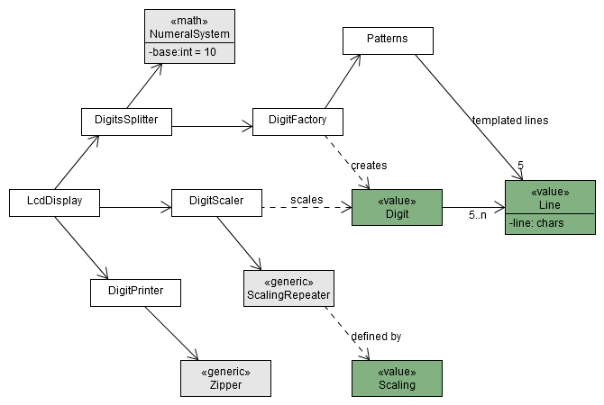

## Creating Tests for LCD Numbers Kata by Mocking Collaborators ##

This is an implementation of the [LCD Numbers Kata](http://rubyquiz.com/quiz14.html)
in Java using outside-in development. There are no tests. In order to unit test its
classes you need to create [test doubles](http://martinfowler.com/bliki/TestDouble.html)
for the collaborators.

This is an [Apache Maven](https://maven.apache.org/) project. Run `mvnw test` to
run your tests. [JUnit](http://junit.org/) and [Mockito](http://site.mockito.org/)
are provided as dependencies.

For other languages see

* [C# with xUnit.net and MOQ](https://bitbucket.org/pkofler/lcd-numbers-mocking-csharp-setup)
* [JavaScript with Mocha and Sinon.JS](https://bitbucket.org/pkofler/lcd-numbers-mocking-js-setup)

## Requirements (copied from Ruby Quiz) ##

The `LcdDisplay` creates an LCD string representation of an integer value using a
4x7 grid of space each, using minus and pipe characters for each digit.
Each digit is shown below:

     --      --  --      --  --  --  --  --
    |  |   |   |   ||  ||   |      ||  ||  |
    |  |   |   |   ||  ||   |      ||  ||  |
             --  --  --  --  --      --  --
    |  |   ||      |   |   ||  |   ||  |   |
    |  |   ||      |   |   ||  |   ||  |   |
     --      --  --      --  --      --  --

The bar size should be adjustable. The default value is 2 - as shown above.
Read more about it at [RubyQuiz](http://rubyquiz.com/quiz14.html).

## Description of Existing Solution ##

To make things easier for you, here is the description of the solution used in the code:
The `LcdDisplay` is the entry point. The given number is split into digits according to the
used `NumeralSystem` (which is the Decimal System in our case). Then the initial `Digit`s are
created by copying the template `Line`s from `Patterns`. Then the (LCD) digits are scaled
by `DigitScaler` according to the `Scaling` value. The actual scaling is done inside
the `ScalingRepeater` by repeating certain rows and columns of the template. Finally
the list of digits is combined to a single String by the `DigitPrinter`.

There is a class `Main` to see the LCD Numbers working. There you can see how all the
classes are assembled and collaborators are combined with each other.
You can run the `Main` with

    java org.codecop.lcdnumbers.Main <number, e.g. 123> <size, e.g. 2>

## Creating Unit Tests ##

Create unit tests for all classes. Make sure all units are tested in isolation.
The point of this exercise is to go extreme to practise using test doubles.
**Create test doubles for everything!** Create dummy objects for all used values
and stub all collaborators, even the most simple classes like `Scaling` and `Line`.

1. Start testing the simple units like `Scaling`, `Line` and `Digit`.
   These units have a single (interesting) method with a single collaborator.
1. Work on `DigitScaler` and `DigitPrinter`. Both have more logic, but still only
   a single collaborator.
1. Things are getting more complicated with `DigitsSplitter`.
1. Finally go for `LcdDisplay` which has three collaborators.

There are sample LCD outputs in the `src/test/resources` folder to be used in tests.
The `size_1`, `size_2` and `size_3` folders contain each digit in original size and
scaled twice and three times.

### Check your Coverage ###
To measure your progress you should use code coverage tools:

* EclEmma inside of Eclipse.

* [Cobertura](http://cobertura.github.io/cobertura/) - type `mvnw cobertura:cobertura`
  or run `cobertura.bat` or `./cobertura.sh`.

* [PIT](http://pitest.org/) - type `mvnw test-compile org pitest:pitest-maven:mutationCoverage`
  or run `pit.bat` or `./pit.sh`.
  Note that PIT does not work if there are any blanks in the path names leading to the current location.

### Warning ###
Enforcing all calls to other classes in a test is not recommended in real unit tests
because this leads to bad tests which are bound to the implementation. These
over specified tests make it impossible to change the code under test without breaking.
We want to be able to change the code without breaking the test as long as the
required functionality is not changed. This exercise is for practising test doubles.

### License ###
This work is licensed under a [New BSD License](http://opensource.org/licenses/bsd-license.php), see `license txt` in repository.

### Contributions ###
Thanks to [Ilke Zilci](https://bitbucket.org/ilke/) for trying out this exercise.